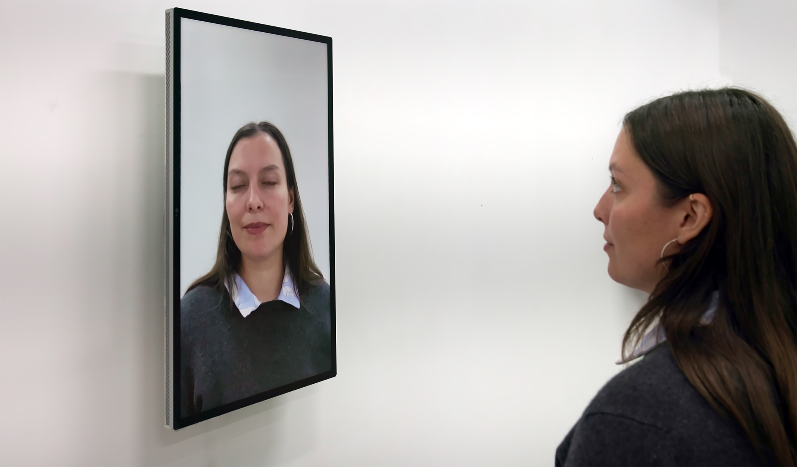

### Selección de Proyectos interesantes de [*Creativeaplications*](https://www.creativeapplications.net/)

02/02/2026

---
### 
[Submirror](https://www.creativeapplications.net/project/submirror-self-perception-loss-of-control-and-digital-puppetry/) – Autopercepción, pérdida de control y marionetas digitales
Es una obra con espejos digitales que manipulan el reflejo del espectador en tiempo real. En lugar de mostrar una imagen fiel, el espejo altera la mirada, los parpadeos o la postura usando código Morse e inteligencia artificial, haciendo que el reflejo actúe por su cuenta. Así, la obra cuestiona cómo la tecnología puede apropiarse de nuestra imagen y representación, generando una sensación de pérdida de control sobre nuestro propio yo.

---
###  [Durr](https://www.creativeapplications.net/project/durr-shivering-bracelet-that-investigates-our-perception-time/) – Shivering bracelet that investigates our perception of time
Es una pulsera que vibra cada 5 minutos para hacernos conscientes de cómo percibimos el paso del tiempo en distintas situaciones. Busca aumentar nuestra atención sobre en qué usamos el tiempo, mostrando que a veces pasa rápido y otras lento según lo que hacemos.

---
### [O.System](https://www.creativeapplications.net/project/o-system-the-future-of-personal-electronics-by-peter-krige-rca-ide/) – El futuro de la electrónica personal – RCA IDE 2012
Es un modelo de electrónica personalizada donde los dispositivos se diseñan y fabrican bajo demanda usando cortadora laser y fabricación digital. Permite elegir funciones y forma, actualizar componentes y reciclar piezas, para reducir residuos electrónicos y crear productos que duren más.

